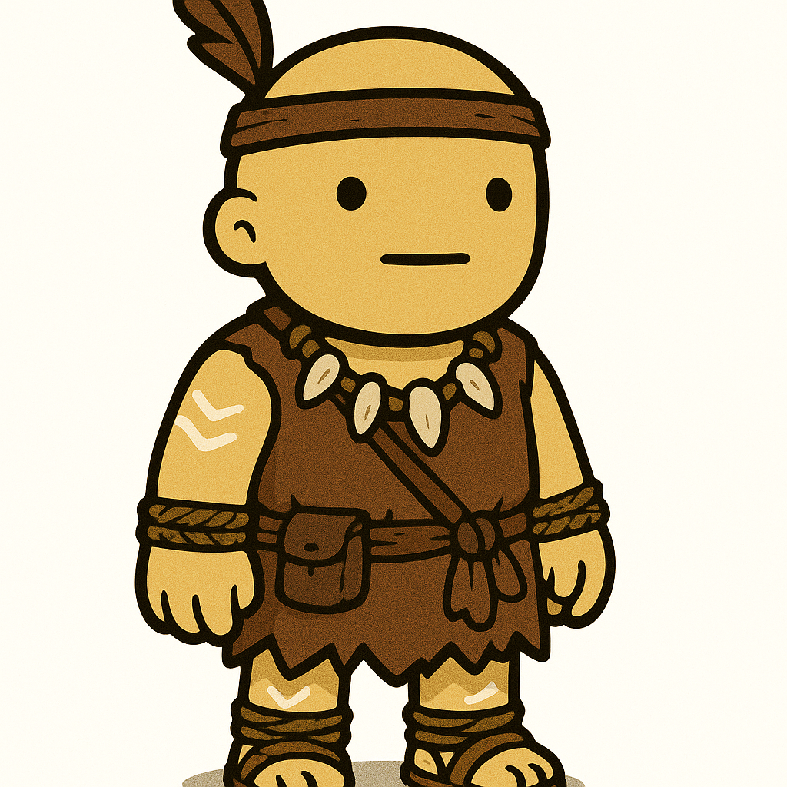
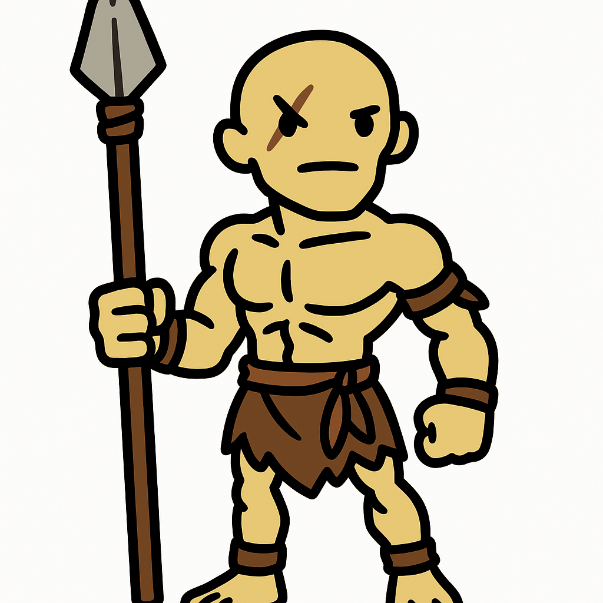
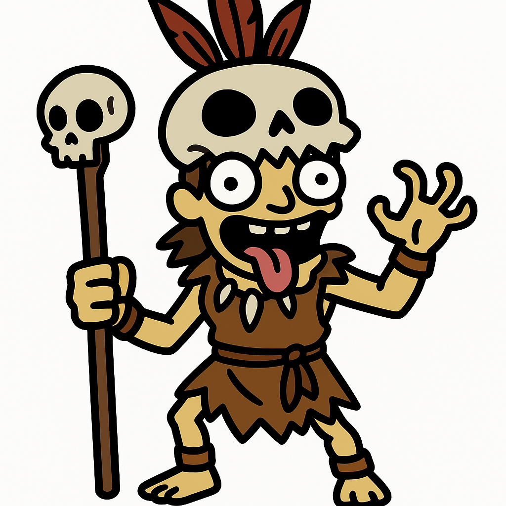
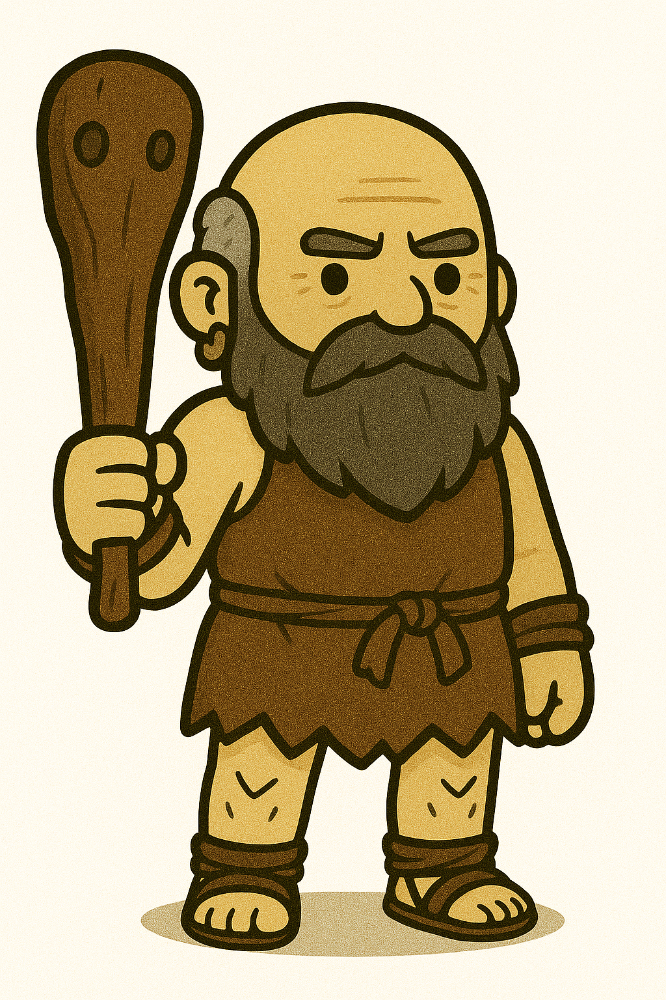
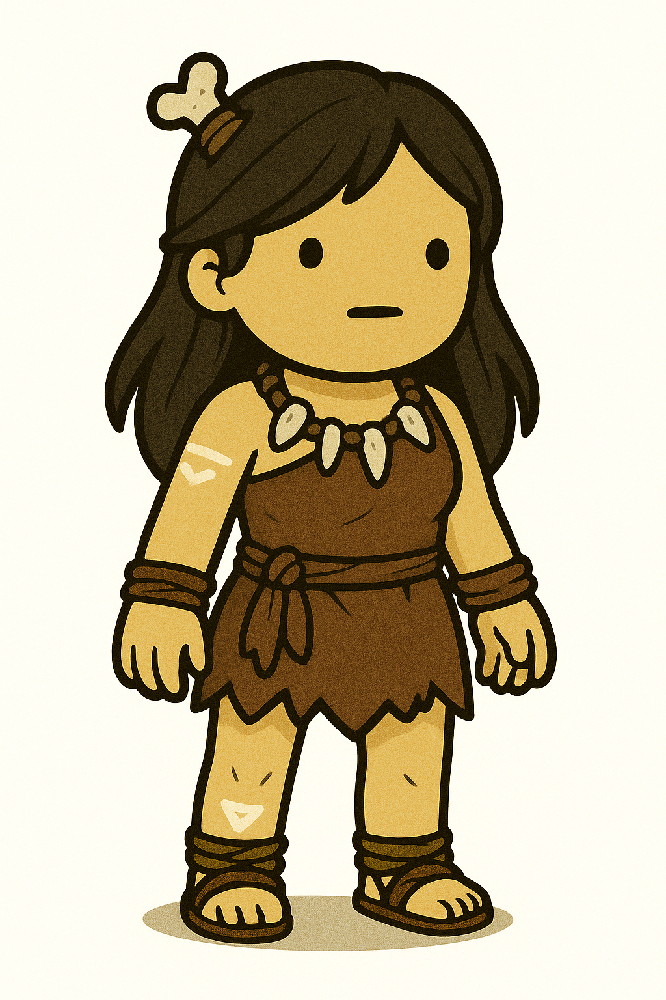
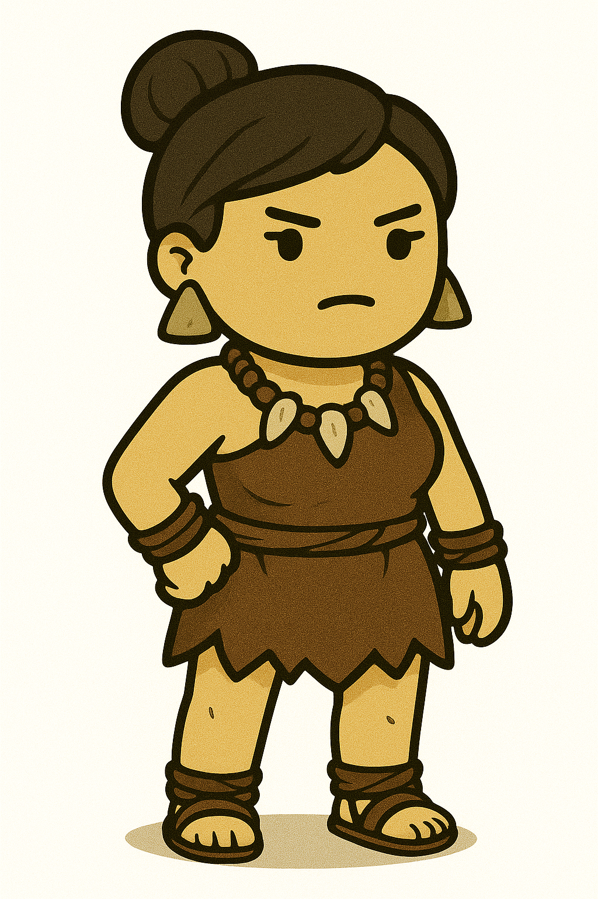
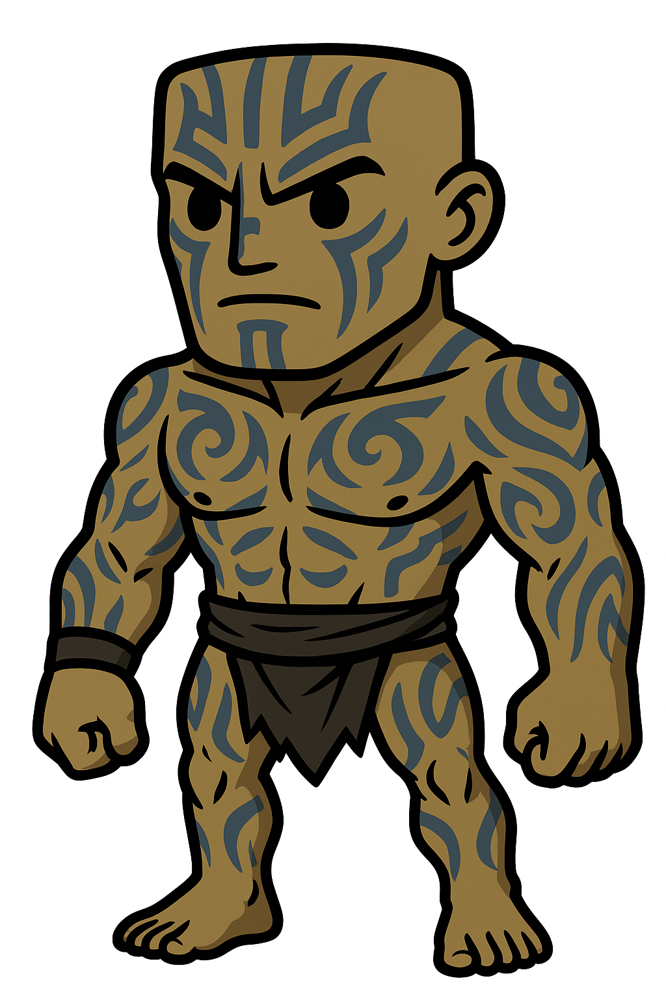
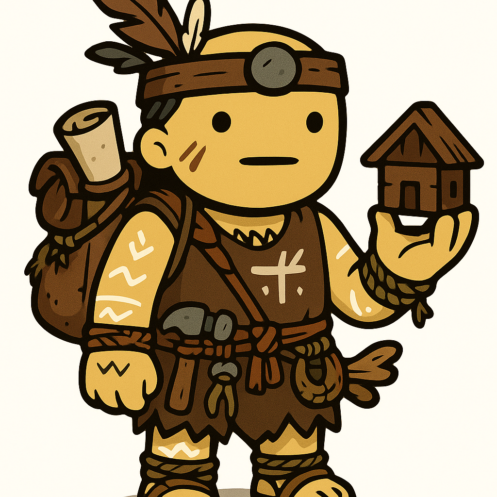

# 🎨 Game Art Portfolio

Welcome to my collection of game art assets made in Inkscape. These assets include characters, UI elements, and props.
## 🖼️ PNG Previews

Here are some preview images of the illustrations:

## 🧍 Character Example

